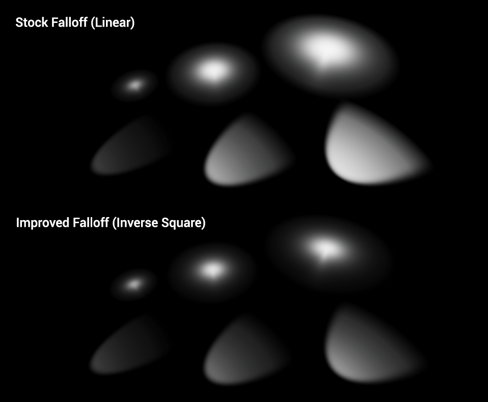
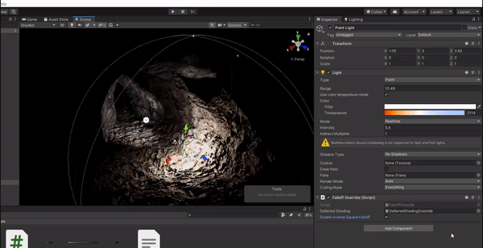

# Built-In-ISF
## Inverse Square Falloff for Built-In Unity Lights 

Around a year ago I shipped my [Falloff Customizer](https://github.com/alexismorin/Falloff-Customizer). While useful, it's still a little wonky and overengineered for what I want: Inverse Square Falloff in the Built-In Unity Render Pipeline!

With the built-in renderer, Unity lights use a linear falloff model. In nearly every single instance, this won't be what you want or compare to lighting in other game engines (or the Unity URP/HDRP)! Especially if you're using linear color space and the deferred render path, you'll probably want this issue fixed as soon as possible. With this small gizmo, you can basically just drop a script onto your Camera and then toggle ISF on or off.

### How to Use

**This assumes you are using linear lighting and the deferred render path. I don't really use forward rendering but if you really need it do message me!**

1. Drag in the "Built-In SIM" folder anywhere in your project.
2. Place the *BuiltInISF* script somewhere in your scene. You can switch the falloff per-scene with this script!
3. From the folder, drag the *DeferredShadingOverride* shader onto the shader slot in the *BuiltInISF* scipt! How this script works is that it overrides Unity's stock deferred rendering shader for one with different falloff values.
4. Toggle the checkbox on an off - you should see falloff for point and spot lights change accordingly!
